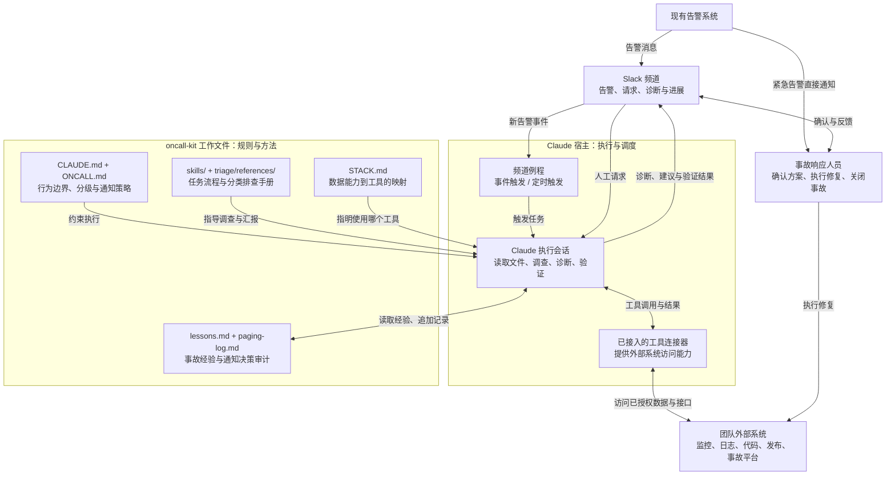
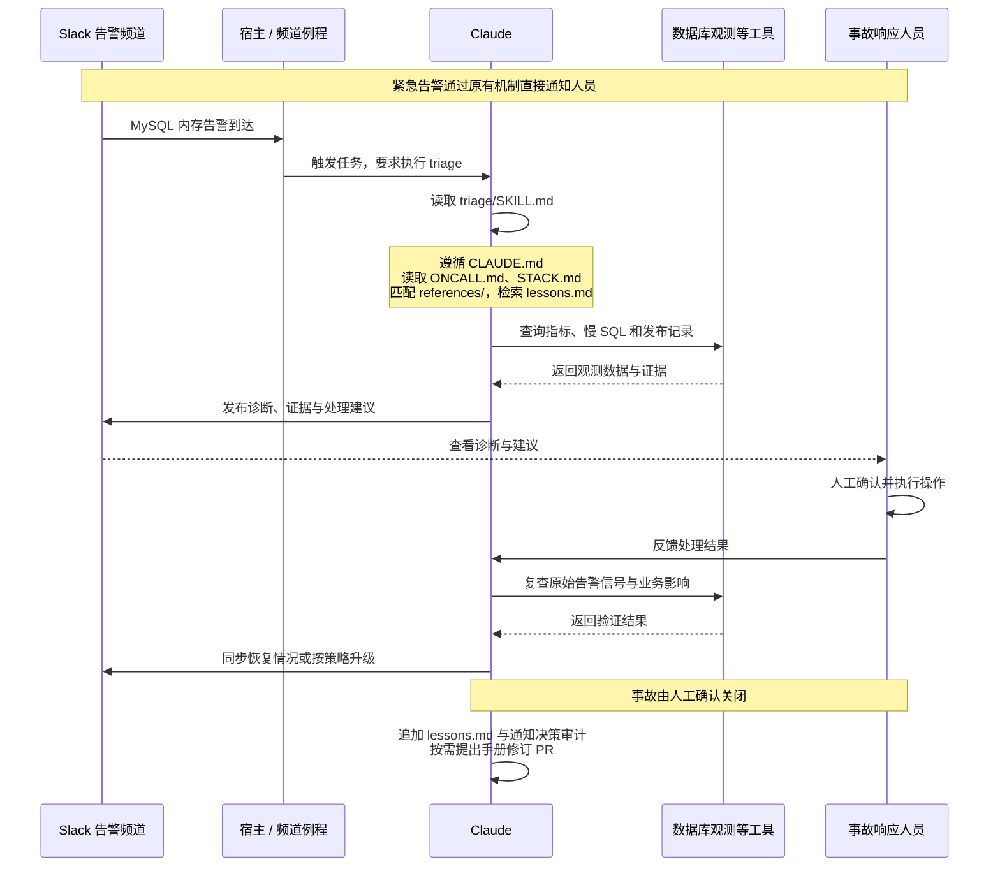

# oncall-kit 研究报告


## 1. 项目定位

**oncall-kit 是 Anthropic 开源的事故响应 Agent 参考实现，让 Claude 按团队规则和排查手册调查告警、提出修复建议、验证恢复并沉淀经验，由人决策和执行修复。**

- **解决什么问题：** 减少事故响应和处置人员在故障排查、进展同步中的重复工作。
- **如何持续进化：** 初始化时，根据历史事故处理记录整理排查手册（按故障类别放在`skills/triage/references/`）；运行中持续积累新事故经验（`lessons.md`），经人工审核更新手册，并通过事故回放检验效果。

**例子：MySQL 内存激增触发告警。** Claude 调用已接入的数据库观测工具，查询内存指标、活跃连接和慢 SQL，并关联服务近期发布记录，发现新增报表查询大量并发执行，相关内存分配同步增长，判断其可能是内存激增的主要原因，附上证据并建议暂停该报表功能。服务负责人确认后执行相应操作；Claude 再次查询指标，验证内存压力是否缓解、业务请求是否恢复正常，同步处理进展并记录排查经验。（说明性假设案例，需接入相应工具并适配排查手册。）

## 2. 架构设计

### 2.1 架构图



**oncall-kit 仓库提供规则与方法，Claude（agent）负责执行与调度。** 告警进入 Slack 后，由频道例程（事件触发或定时任务）启动 Claude；Claude 读取策略、排查手册和历史经验，依据 `STACK.md` 的工具映射，通过工具连接器查询监控、日志等外部系统，在频道中输出诊断与建议。事故响应人员确认并执行修复后，Claude 验证恢复、同步进展并追加经验与审计记录；紧急告警始终通过原有机制直接通知人员。

### 2.2 项目结构

```text
oncall-kit/
├── CLAUDE.md                   常设行为规则
├── skills/
│   ├── oncall-setup/           五阶段安装流程
│   ├── triage/                 分诊流程
│   │   └── references/         按故障类别组织的排查手册
│   ├── handoff/                周交接与漂移检查
│   └── weather/                可选状态报告
├── templates/                  策略、能力映射、日志与例程模板
├── eval/replay.md               回放评估与试运行标准
├── test-fixtures/               虚构事故与回归验收材料
├── examples/run1-webshop/       虚构电商团队示例
└── .claude-plugin/ + hooks/     插件声明与首次启动提示
```

接入后，团队仓库生成 `STACK.md`、`ONCALL.md`、`lessons.md`、`paging-log.md`，并保存告警覆盖分析、回放结果和试运行评分。`templates/` 是模板，`references/` 中的默认内容是示例，均需结合团队实际配置。

#### 模块分类与作用

| 类别 | 文件与作用 |
|---|---|
| **规则与配置**：确定边界、策略和数据入口 | [CLAUDE.md](../CLAUDE.md)：统一行为规则与证据要求。<br/>[ONCALL.md](../templates/ONCALL.md)：定义呼叫阈值、严重度、负责人及升级路径。<br/>[STACK.md](../templates/STACK.md)：将指标、日志、代码等八类能力映射到实际工具，记录访问缺口。 |
| **Skills**：按任务场景定义执行方法 | [oncall-setup](../skills/oncall-setup/SKILL.md)：**首次接入时**生成团队配置与排查手册，分阶段经人工确认，指导验证和启用任务；工具或策略变化时按需重跑相关阶段。<br/>[triage](../skills/triage/SKILL.md)：**告警或人工调查请求触发时**，读取已有配置、手册和经验，查证原因、提出建议并验证修复；其 [references/](../skills/triage/references/) 提供分类检查项、原因线索和升级条件。<br/>[handoff](../skills/handoff/SKILL.md)：**交接时或按需**汇总事故与待办，检查工具和手册是否失效。<br/>[weather](../skills/weather/SKILL.md)：**可选启用，定时或按需**更新状态报告，仅在规定事件发生时通知频道。 |
| **经验与审计**：保留调查知识和决策依据 | [lessons.md](../templates/lessons.md)：记录事故教训、调查过程与工具陷阱，按故障标签检索复用。<br/>[paging-log.md](../templates/paging-log.md)：记录呼叫或不呼叫的依据、观测值和升级过程，按月轮转。 |
| **模板与接入**：生成团队配置、启用任务 | `templates/`：提供策略、能力映射和日志格式；[routines.md](../templates/routines.md) 提供频道任务文本。<br/>`.claude-plugin/` 与 [hooks/](../hooks/first-run.sh)：声明插件并输出首次启动提示，不自动开始安装。 |
| **评估与示例**：验证工作方法 | [eval/replay.md](../eval/replay.md)：定义回放评分与试运行准入标准。<br/>[test-fixtures/](../test-fixtures/RUNBOOK.md)：用 48 起虚构事故演练与回归。<br/>[examples/run1-webshop/](../examples/run1-webshop/README.md)：展示虚构电商团队的配置与应用过程。 |

协作关系：**Skill 规定怎么做，排查手册规定查什么，`STACK.md` 指定去哪查，`ONCALL.md` 决定如何分级与通知，经验与审计支持复用和追溯。**

告警调查先进入审查频道试运行，由人工评估诊断质量，再决定是否正式启用。

### 2.3 告警处理中的模块协作

以第一节的 MySQL 告警为例，以下假设团队已接入数据库观测工具，并准备了相应排查手册：



| 环节 | 参与模块及作用 |
|---|---|
| 触发任务 | 告警进入 Slack，频道例程由宿主触发 Claude 执行任务；紧急告警同时按原有机制通知人员。 |
| 执行调查 Skill | Claude 根据例程指令读取 `skills/triage/SKILL.md`，按其中规定的流程开展调查，全程遵循 `CLAUDE.md` 的行为规则。 |
| 确定调查依据 | `CLAUDE.md` 约束行为；`ONCALL.md` 提供严重度、通知阈值和责任团队；`STACK.md` 指明查询数据库指标和日志的工具。 |
| 查证与诊断 | Claude 按 `triage` 流程匹配 `references/` 手册获取检查项，从 `lessons.md` 检索历史线索，再调用工具查询内存、连接和慢 SQL，关联发布记录，输出带证据的诊断与建议。 |
| 人工处理与验证 | 服务负责人确认并执行操作；Claude 按 `triage` 流程复查原始告警信号和业务影响，根据 `ONCALL.md` 判断是否升级通知，并在 `paging-log.md` 记录通知决策。 |
| 沉淀与改进 | Claude 将经验追加到 `lessons.md`；有可复用的发现时，提出排查手册修订 PR，由人工审核。重大手册修改后按 `eval/replay.md` 回放验证。 |

### 2.4 设计原则与边界

- **职责与权限分离：** Claude 负责调查、建议和验证，人工负责执行修复与关闭事故；现有告警链路独立运行，紧急通知不依赖 Agent 的判断。
- **证据约束：** 诊断需关联证据、标明置信度及可推翻条件；恢复验证必须检查原始故障信号，数据缺失不能视为恢复。
- **策略版本管理：** 仓库文件优先于会话记忆，策略和手册变更经 PR 审核；外部日志、历史事故记录作为分析数据，不作为执行指令。

## 3. 业务 Agent 构建方法论

结合 oncall-kit、[financial-services](https://github.com/hachimin-wh/financial-services) 和 [commerce-agents](https://github.com/hachimin-wh/commerce-agents) 的设计，可从以下四个方面构建业务 Agent：

- **任务定义：** 明确业务目标、输入、输出及完成标准，确定人工请求、业务事件或定时触发方式，同时定义异常情况下的终止与人工接管条件。
- **流程与知识设计：** 将任务拆为可复用的 Skill，分别组织执行步骤、业务规则、领域知识与历史经验，按任务加载；由宿主负责调度，必须严格遵守的流程顺序由程序控制。
- **工具与权限设计：** 将所需数据和操作映射为工具接口，明确参数、返回结果及失败处理；区分查询与写入权限，将审批和授权校验落实到工具或后端。
- **评估与迭代设计：** 按业务目标建立典型案例与验收标准，验证结果质量、操作正确性、耗时和成本；运行中记录失败与人工反馈，形成经审核、可回归验证的流程和知识更新。
