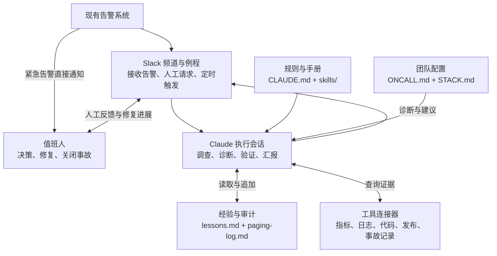

# oncall-kit 研究报告

> 基于仓库版本 `c03282c`，研究范围为架构与实现机制。

## 1. 项目定位

**oncall-kit 是 Anthropic 开源的 AI 辅助值班参考实现，核心是规则、排查手册和评估流程。** Claude 在 Slack 事故频道中调查告警、提出修复建议、验证恢复并记录经验；人负责决策、执行修复和关闭事故。

项目主要减少三类重复工作：跨系统收集排障信息、同步事故进展、整理经验与交接。默认手册面向 CI/CD，安装时可根据团队历史事故生成其他业务的排查手册。

仓库不包含独立的 Agent 引擎或调度服务，运行依赖 Claude 宿主、Slack 和工具连接器。上游将其定位为不维护的参考实现，采用方需自行适配和维护。

## 2. 架构设计

四条原则贯穿系统：

- **人机分工：** 现有告警直接通知人；Claude 查证和建议，人执行修复、关闭事故。
- **职责分离：** 频道例程决定何时运行，仓库手册和策略决定如何处理。
- **文件为准：** 策略、工具映射和经验保存在仓库，优先于会话记忆；策略与手册修改走 PR。
- **证据驱动：** 诊断附证据、置信度和可推翻条件；外部日志作为数据，不能改变执行规则。

Claude 默认只读访问被监控系统，可发消息、记录日志和按策略呼叫。唯一受限扩展是经团队启用、逐条批准后新增告警规则，不得修改、删除或静默既有规则。

### 2.1 系统组成



**宿主提供执行和调度，仓库提供工作方法，连接器提供数据访问。** 事故记录仍保存在团队已有的线程、工单或事故平台中。Claude Code 可用于本地演练和前期配置，频道例程需在 Slack 中由人安装。

### 2.2 项目结构

```text
oncall-kit/
├── CLAUDE.md                   常设行为规则
├── skills/
│   ├── oncall-setup/           五阶段安装流程
│   ├── triage/                 分诊流程
│   │   └── references/         按故障类别组织的排查手册
│   ├── handoff/                周交接与漂移检查
│   └── weather/                可选状态报告
├── templates/                  策略、能力映射、日志与例程模板
├── eval/replay.md               回放评估与试运行标准
├── test-fixtures/               虚构事故与回归验收材料
├── examples/run1-webshop/       虚构电商团队示例
└── .claude-plugin/ + hooks/     插件声明与首次启动提示
```

接入后，团队仓库生成 `STACK.md`、`ONCALL.md`、`lessons.md`、`paging-log.md`，并保存告警覆盖分析、回放结果和试运行评分。`templates/` 是模板，`references/` 中的默认内容是示例，均需结合团队实际配置。

### 2.3 模块分类与作用

| 类别 | 文件与作用 |
|---|---|
| **规则与配置**：确定边界、策略和数据入口 | [CLAUDE.md](../CLAUDE.md)：统一行为规则与证据要求。<br/>[ONCALL.md](../templates/ONCALL.md)：定义呼叫阈值、严重度、负责人及升级路径。<br/>[STACK.md](../templates/STACK.md)：将指标、日志、代码等八类能力映射到实际工具，记录访问缺口。 |
| **Skills**：定义各类任务的执行方法 | [oncall-setup](../skills/oncall-setup/SKILL.md)：探测连接、挖掘历史、确认策略、验证并安装。<br/>[triage](../skills/triage/SKILL.md)：关联告警、查证原因、提出建议并验证修复；其 [references/](../skills/triage/references/) 按故障类别提供症状、首查清单、原因线索和升级条件。<br/>[handoff](../skills/handoff/SKILL.md)：生成周交接与待办，检查工具和手册是否失效。<br/>[weather](../skills/weather/SKILL.md)：更新状态报告，仅在规定事件发生时通知频道。 |
| **经验与审计**：保留调查知识和决策依据 | [lessons.md](../templates/lessons.md)：记录事故教训、调查过程与工具陷阱，按故障标签检索复用。<br/>[paging-log.md](../templates/paging-log.md)：记录呼叫或不呼叫的依据、观测值和升级过程，按月轮转。 |
| **模板与接入**：生成团队配置、启用任务 | `templates/`：提供策略、能力映射和日志格式；[routines.md](../templates/routines.md) 提供频道任务文本。<br/>`.claude-plugin/` 与 [hooks/](../hooks/first-run.sh)：声明插件并输出首次启动提示，不自动开始安装。 |
| **评估与示例**：验证工作方法 | [eval/replay.md](../eval/replay.md)：定义回放评分与试运行准入标准。<br/>[test-fixtures/](../test-fixtures/RUNBOOK.md)：用 48 起虚构事故演练与回归。<br/>[examples/run1-webshop/](../examples/run1-webshop/README.md)：展示虚构电商团队的配置与应用过程。 |

协作关系：**Skill 规定怎么做，排查手册规定查什么，`STACK.md` 指定去哪查，`ONCALL.md` 决定如何分级与通知，经验与审计支持复用和追溯。**

## 3. 运行流程

### 3.1 事故处理

**告警触发调查，事故由人声明；Claude 负责查证、建议与验证，人负责执行修复和确认关闭。**

| 步骤 | 执行动作 | 输出 |
|---|---|---|
| 1. 触发 | 告警进入频道或人发起请求；紧急告警仍直接通知值班人 | 调查任务 |
| 2. 加载 | Claude 读取策略、工具映射、相关经验与故障手册 | 调查依据 |
| 3. 查证 | 关联同源告警，查询指标、日志与变更时间线 | 带链接的观测结果 |
| 4. 诊断 | 提出原因与修复建议；对人的质疑重新查证 | 原因、影响、建议、置信度 |
| 5. 修复与验证 | 人执行修复；Claude 检查原始故障信号，未恢复则按策略升级 | 恢复证据或升级通知 |
| 6. 关闭与沉淀 | 人关闭事故；Claude 记录经验、提出手册修订 | 事故记录与经验更新 |

关键约束：

- **诊断格式固定：** 现象、原因及置信度、影响面、建议修复、已排除项、可推翻结论的证据。
- **调查按需并行：** 默认顺序执行；紧急呼叫级事故在宿主支持时按数据源并行，主会话统一归因。
- **验证次数有限：** 默认在预期恢复窗口的半倍、一倍、两倍各检查一次；必须验证原始症状，不能用其他指标正常代替。
- **通知留有审计：** Claude 对调查中新发现的问题按策略决定是否呼叫，记录依据；不替代现有告警链路。

### 3.2 安装与准入

| 阶段 | 主要工作 | 产物 |
|---|---|---|
| Discover · 能力探测 | 确認可用连接与访问缺口 | `STACK.md` |
| Mine · 历史挖掘 | 从约定范围的历史事故提炼故障类别和排查方法 | 手册草稿、经验、路由建议 |
| Interview · 策略确认 | 人确定阈值、严重度、负责人和升级路径 | `ONCALL.md` |
| Validate · 回放验证 | 使用未参与手册编写的事故，盲测并独立评分 | 回放评分与修订建议 |
| Install · 例程安装 | 验证频道访问，由人逐项启用任务 | 频道例程与登记记录 |

每阶段人工确认后进入下一阶段。质量准入分两步：

- **历史回放：** 预留 5–10 起事故，仅提供检测时刻已知信息；正确与部分正确合计至少 70%，且无有害结果。这是小样本准入标准，不是生产准确率。
- **Shadow 试运行：** 诊断进入审查频道，人工值班照常运行。参考退出条件为连续至少 10 次诊断被认定有帮助，且期间无有害结果；两周触发评审，不自动转正。

### 3.3 持续改进与评估

**经验追加 → 手册修订 PR → 人工评审 → 回放验证**，构成持续改进闭环。同一机制积累三条经验，或单条经验形成可执行清单时，可提议纳入手册；不自动修改策略。

周交接检查工具与手册是否失效，重大手册或基础设施变更后重新回放。可选状态报告只在规定事件发生时通知，变化以频道上次实际收到的消息为基准；数据缺失不能被解释为健康改善。

评估重点是首份诊断耗时、人工认可率、误报、升级率，以及人工排障负担是否降低。规则需要实际权限配合，虚构夹具不覆盖真实连接与调度；诊断质量和运行成本仍需在团队环境中验证。
