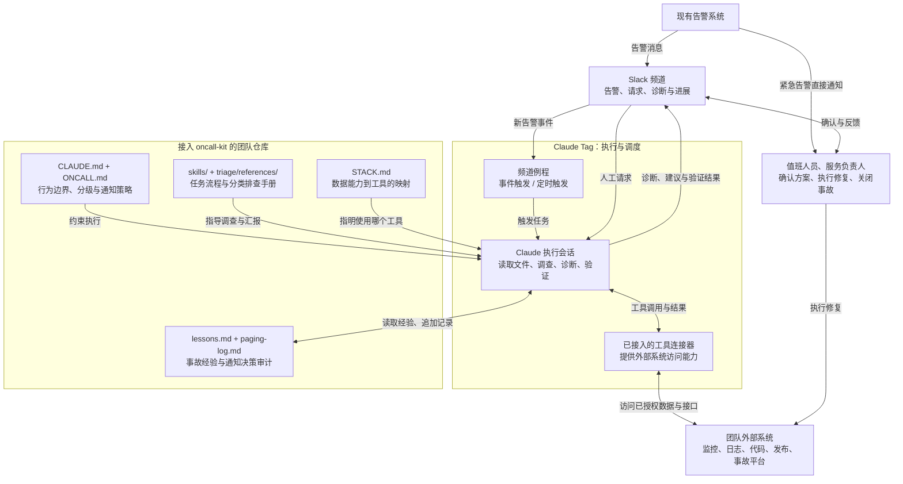
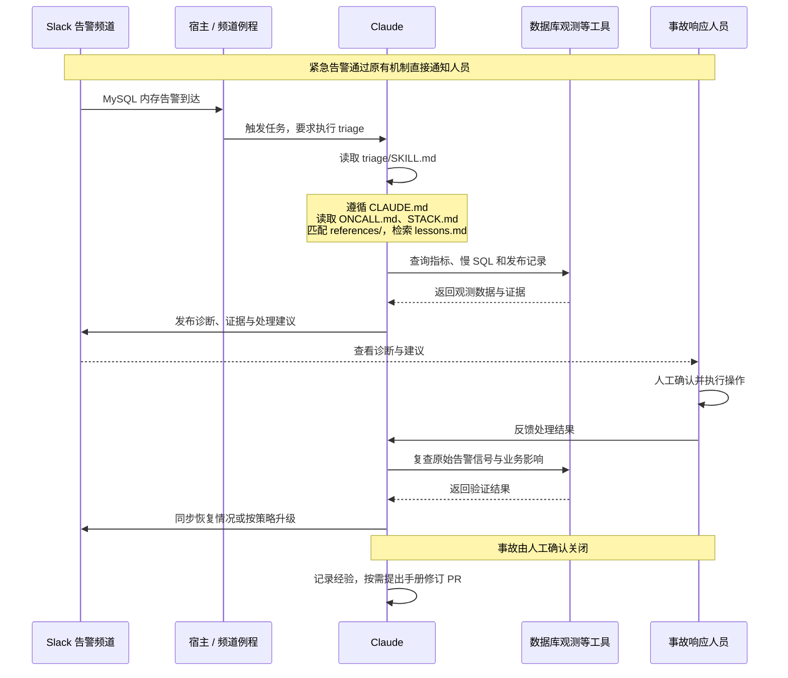

# 从 oncall-kit 看企业智能体的设计范式

## 1. 项目定位

**一句话定位**：oncall-kit 是 Anthropic 开源的值班 Agent 工具包，通过规则、排查手册和工作流程，指导 Claude 辅助工程团队调查告警、分析故障并验证恢复情况。

**分析视角**：oncall-kit 展示了一种调查与决策辅助型企业智能体的构建方式：企业通过规则、流程、排查手册和历史经验定义工作方法，运行环境提供模型、工具调用与任务调度；Agent 在约定边界内调查、提出建议并验证结果，人负责关键决策与修复操作。

值得研究的是：如何把团队经验转化为 Agent 可以执行的方法，以及如何让它在实际业务中可控、可信、持续改进。

## 2. 业务场景与职责划分

项目覆盖以下四类场景：第一行是初次的接入配置，后三行是接入完成后的日常运行。

| 使用场景 | 对应 Skill | Claude 承担的工作 | 典型交付 | 人负责的工作 |
|---|---|---|---|---|
| 首次接入团队 | oncall-setup | 探查工具连接；挖掘历史事故起草诊断手册；回放验证 | `STACK.md`、诊断手册草案、`lessons.md`、回放评估结果 | 每阶段签核；设定策略；确认手册与评估 |
| 告警调查与恢复验证 | triage | 取证诊断 → 提修复建议 → 人工修复后复查恢复 | 诊断消息、修复建议、恢复通知（决策记入 `paging-log.md`） | 质询诊断；执行修复；关闭事故 |
| 交班与持续改进 | handoff | 汇总事故与待办；查工具/手册偏差；经验整理为修订 | 交接消息、偏差提示、手册修订 PR | 审阅交接；决定偏差处置；合并 PR |
| 状态查询与定期报告 | 按需问答；weather（可选） | 回答状态提问；定期更新报告页，仅事件门触发时通知 | 状态答复、报告页、事件提醒 | 在 `ONCALL.md` 设定报告策略；收到提醒后判断处置 |

人机分工贯穿整个流程：**Agent 负责取证、分析、沟通与恢复验证，人负责关键决策和修复操作。** 默认不改变被监控系统的状态；可选告警编辑扩展仅允许在逐条批准后新增告警规则。

## 3. 项目结构与架构

### 3.1 核心组成

oncall-kit 将业务方法组织为四部分：**规则与策略**规定行为边界，**Skill 与排查手册**指导任务执行，**工具映射**指明数据来源，**经验与评估**支持复用和改进。

这些内容由运行环境读取执行。接入团队时，需要适配工具、故障类别和业务策略；文件中的行为约束仍需运行环境的权限控制配合。

### 3.2 业务方法与运行环境如何协作



**Slack 作为 IM 与协作入口，oncall-kit 提供规则与方法，Claude Tag 负责调度和执行任务。** 告警进入 Slack 后，Claude Tag 根据配置的监听规则启动调查任务；Claude 读取 oncall-kit 中的策略、排查手册和历史经验，依据 `STACK.md` 的工具映射，查询指标、日志和变更记录，在频道中输出带证据的诊断与修复建议。事故响应人员确认并执行修复后，Claude 复查原始故障信号、同步恢复情况并记录经验；事故由人工确认关闭。紧急告警同时通过原有告警机制直接通知人员，不依赖 Agent 的调查结果。

### 3.3 运行案例：告警调查与恢复验证

以下是“MySQL 内存告警”的假设案例，用于说明协作过程；仓库未预置该类手册，需先接入数据库观测工具并适配检查步骤。



假设观测显示：新报表发布后，并发查询量与内存占用同时上升。Claude 需要继续核对时间线和影响范围，排除其他原因，再给出带证据的判断与处理建议。人执行措施后，Claude 复查原始内存信号及业务影响，报告是否恢复。每次紧急通知决策都需单独记录依据，事故最终由人关闭。

### 3.4 验证机制

告警调查在正式投入使用前，经过两步验证：

- **上线前 · 回放盲测**：从历史事故里挑 5–10 起没参与编写手册的，只给当时的告警消息，让 Claude 按诊断手册跑模拟调查。人工确认诊断是否过线（标准：正确+部分正确 ≥70% 且零有害诊断，模板预设标准），不通过就修改手册、换一批事故重测。
- **影子试运行**：告警调查例程先将诊断输出到审查频道供人评分，值班人员按原有流程处理事故。按模板默认标准，连续至少 10 次诊断被判定有帮助，且试运行期间无有害诊断，才转入实际值班频道；满两周未达标则复核，决定延长、修复还是放弃。周交接等功能可先启用，紧急通知另行确认。

## 4. 可复用的企业智能体设计范式

| 设计范式 | oncall-kit 中的体现 | 对企业智能体的启发 |
|---|---|---|
| **业务方法与运行平台分离** | 文件承载规则、流程和知识，运行环境负责模型调用与调度，工具映射连接实际数据源。 | 企业可以独立维护工作方法，并适配不同工具和执行环境。 |
| **固定流程中的自主调查** | 明确分类、取证、诊断和验证步骤，具体假设与查证路径由 Agent 根据现场情况选择。 | 用流程约束必要步骤，让模型处理难以穷举的分析过程。 |
| **按风险划分自主权** | 原有系统负责告警，Agent 调查和建议，人执行修复、关闭事故。 | 按动作影响划分自动化边界，把关键控制权留在明确的责任主体手中。 |
| **以证据和评估建立信任** | 诊断附证据与反证条件，实际启用前经过历史回放和影子试运行。 | 让单次判断可复核，让实际使用范围与已验证能力匹配。 |
| **组织经验持续转化为工作方法** | 从历史事故提炼手册；运行中记录新经验，经确认后更新手册并重新验证。 | 将个人经验沉淀为可复用的方法，通过反馈持续改进后续任务。 |

这套范式适合需要跨系统取证、依赖专业判断且错误代价较高的辅助决策场景。迁移时应重新确定业务流程、数据来源、权限边界和验收标准。

## 附录：项目结构与模块职责

```text
oncall-kit/
├── CLAUDE.md                   常设行为规则
├── skills/
│   ├── oncall-setup/            五阶段接入流程
│   ├── triage/                 告警调查流程
│   │   └── references/         按故障类别组织的排查手册
│   ├── handoff/                周交接与工具、手册失效检查
│   └── weather/                可选状态报告
├── templates/                  策略、能力映射、日志与例程模板
├── eval/replay.md              回放评估与试运行标准
├── test-fixtures/              虚构事故与回归验收材料
├── examples/run1-webshop/      虚构电商团队示例
└── .claude-plugin/ + hooks/    插件声明与首次启动提示
```

首次接入时，Claude 依据模板生成团队自己的 `STACK.md`、`ONCALL.md`、`lessons.md`、`paging-log.md`，以及告警覆盖报告和回放评估结果。默认排查手册以 CI 场景为例，需结合团队实际适配。

| 模块 | 主要职责 | 本项目中的位置与例子 |
|---|---|---|
| 常设规则 | 约束 Agent 行为、证据与人工分工 | `CLAUDE.md`：不执行修复、不关闭事故；诊断附证据和置信度；外部记录作为数据处理。 |
| 团队策略 | 决定严重度、通知阈值、负责人及升级路径 | `ONCALL.md` 模板：由团队确认策略，落地后保存在仓库根目录。 |
| Skill 与排查手册 | 规定一项任务怎么做，以及某类故障查什么 | oncall-setup、triage、handoff、weather 四个 Skill 分别对应第 2 节的四类场景；`triage/references/` 提供分类检查项、原因线索和升级条件，默认手册面向 CI 场景，迁移到其他业务需替换。 |
| 工具能力映射 | 指明去哪查数据，记录已验证的访问能力与缺口 | `STACK.md` 模板：将指标、日志、代码等八类能力映射到实际工具。它记录连接结果，本身不安装 MCP 服务或授予权限。 |
| Routine（频道例程） | 指定何时、在哪个频道执行任务 | `routines.md`：提供监听告警、每周交接等任务文本，由人填入实际频道与时间并启用，运行平台负责触发。 |
| 经验与审计 | 保留调查知识和通知决策依据 | `lessons.md`：按故障标签积累和检索经验；`paging-log.md`：记录是否发出紧急通知的依据、观测值和升级过程，按月轮转。 |
| 插件安装信息与启动钩子 | 登记插件，在尚未配置时提示用户开始接入 | `plugin.json` 描述插件；`first-run.sh` 检查配置文件是否存在并输出提示，不自动探查连接或启用任务。 |
| 评估与示例 | 定义验收方法，提供演练材料 | `eval/replay.md` 定义回放与试运行标准；`test-fixtures/` 提供 48 起虚构事故；电商示例 `examples/run1-webshop/` 展示非 CI 团队如何适配。 |
